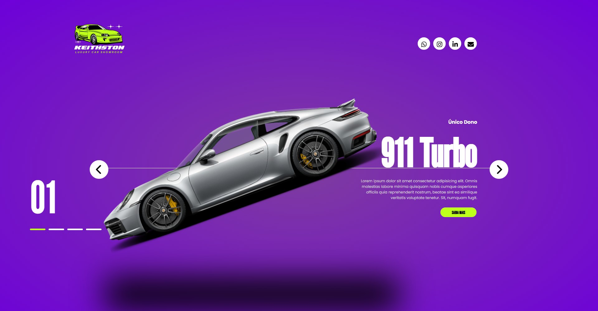

<div align="center">

# KeithSton Luxury Car

Carrossel de carros de luxo com design escuro e transições direcionais animadas, construído com HTML, CSS moderno (aninhamento e variáveis) e JavaScript puro, sem bibliotecas de slider.


[](https://otavio-2507.github.io/KeithSton-Luxury-Car/)
[](https://github.com/OTAVIO-2507/KeithSton-Luxury-Car)

<br>

[](https://otavio-2507.github.io/KeithSton-Luxury-Car/)

</div>

## Visão geral

O projeto implementa um slider completo do zero, com atenção especial à direção das transições: uma variável CSS (`--calculation`) controla se os elementos entram pela esquerda ou pela direita conforme o sentido da navegação. O conteúdo de cada carro entra em cascata, e o controle de estado é feito apenas com classes e manipulação de DOM, demonstrando que um carrossel sofisticado não exige biblioteca externa.

## Funcionalidades

- Navegação por setas com loop contínuo (do último slide retorna ao primeiro)
- Transições direcionais controladas por variável CSS conforme o sentido da navegação
- Animações em cascata para título, descrição e detalhes de cada carro
- Indicadores visuais de posição atualizados dinamicamente
- Efeitos de hover nos botões de navegação
- Tipografia de impacto com League Gothic e Poppins

## Decisões de projeto

Algumas escolhas que não são óbvias pelo código:

**A direção da transição é resolvida antes do slide virar ativo.** O slide que vai entrar é estacionado do lado certo com a transição desligada, o navegador é forçado a recalcular o layout (`void incoming.offsetWidth`) e só então a classe `active` entra. Sem esse passo, a variável CSS `--calculation` e a classe mudariam no mesmo ciclo, e o navegador tomaria a posição antiga como ponto de partida — era por isso que, ao inverter o sentido, o primeiro slide entrava pelo lado errado. Desligar a transição durante o reposicionamento garante que o salto nunca seja animado, independente do que o CSS defina para `.item`.

**O contador usa `padStart`, não concatenação.** Grudar um `'0'` na frente do índice funciona até nove slides; no décimo o indicador mostraria `010`. `String(active + 1).padStart(2, '0')` sobrevive ao crescimento da lista.

**`100svh` logo depois de `100vh`.** No celular, `100vh` conta a barra de endereço mesmo quando ela está visível, e parte do slide fica escondida embaixo dela. A segunda declaração usa a altura realmente disponível; navegadores que não conhecem a unidade ignoram a linha e ficam com o valor anterior.

**Aninhamento nativo de CSS, sem pré-processador.** A folha usa `&` direto no navegador, o que mantém o projeto sem etapa de build — não há nada para compilar antes de abrir o `index.html`.

## Tecnologias

| Tecnologia | Aplicação no projeto |
| --- | --- |
| HTML5 | Estrutura do carrossel e da navegação |
| CSS3 | Aninhamento, variáveis (`--calculation`), grid, flexbox e transições |
| JavaScript (ES6+) | Controle de estado dos slides e manipulação de classes |
| Font Awesome | Ícones das setas de navegação |
| Google Fonts | Tipografia (League Gothic, Poppins) |

## Como executar

```bash
git clone https://github.com/OTAVIO-2507/KeithSton-Luxury-Car.git
cd KeithSton-Luxury-Car
```

Abra o arquivo `index.html` no navegador. As dependências são carregadas via CDN.

## Estrutura do projeto

```
KeithSton-Luxury-Car/
├── index.html              Página do carrossel
└── src/
    ├── javascript/
    │   └── script.js       Navegação e controle de slides
    ├── style/
    │   └── styles.css      Transições, variáveis e layout
    └── img/                Imagens dos carros e logotipos
```

